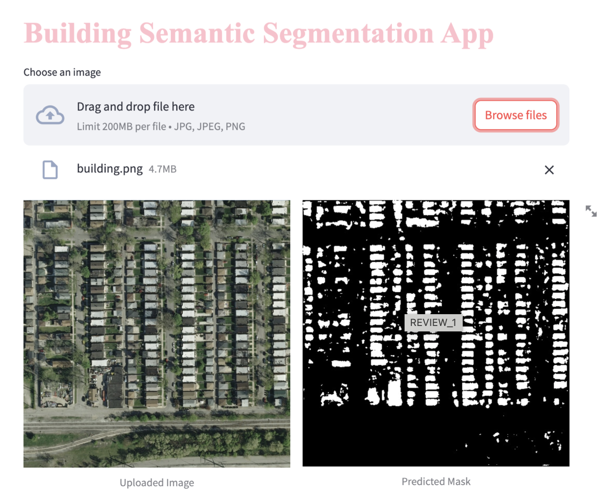
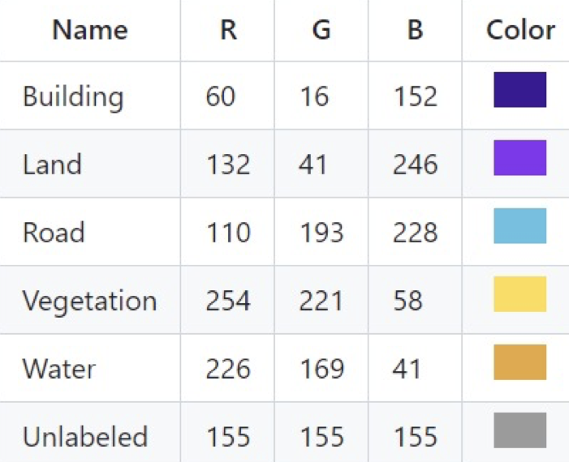
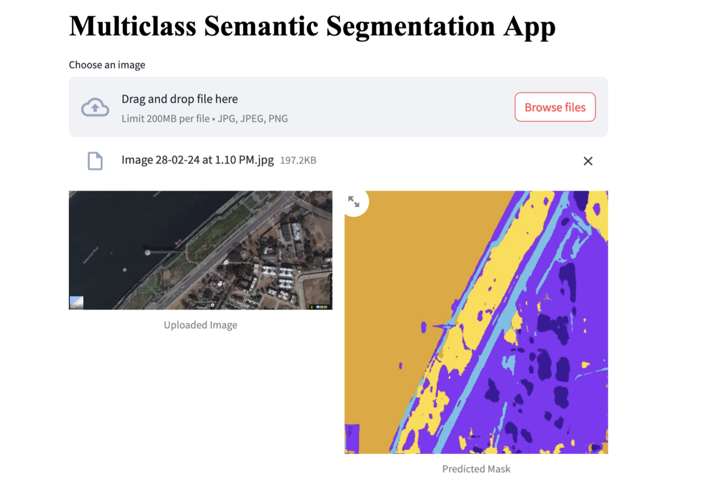

# Image-segmentation

## Binary Class Image Segmentation

This project focuses on binary class image segmentation of buildings from satellite-captured aerial imagery. The goal is to classify buildings in the imagery, separating them from the background.

### Dataset

- The dataset consists of **137 images** and **137 corresponding masks** for training.
- Additionally, there are **10 test images** and **10 test masks** for evaluation.
- All images are captured via satellite and consist of aerial views of buildings, segmented into two classes: **buildings** and **non-buildings**.

### Project Aim

The primary objective is to implement **binary class image segmentation** to correctly identify and classify buildings in the satellite images. This helps in extracting accurate boundaries and structures of buildings from the aerial imagery.

## Output 

## Multiclass Image Segmentation of Aerial Imagery

This project involves multiclass image segmentation of aerial imagery captured by satellites. The dataset includes pixel-wise semantic segmentation into 6 different classes.

### Dataset

- **Total Images:** 72 images, grouped into 6 larger tiles.
- **Classes:** The images are segmented into 6 distinct classes, each represented with a unique color code to facilitate differentiation.
  

  
### Project Aim

The primary objective is to classify all the different classes in the aerial imagery using multiclass image segmentation techniques.

### Preprocessing Steps

1. **Combine Image and Mask Directories:**
   - All images and masks from each individual tile folder were combined to create separate directories for images and masks.

2. **Data Augmentation:**
   - Augmentation techniques were applied to increase the number of input images in the dataset, enhancing the model's ability to generalize.

3. **Train-Test Split:**
   - The preprocessed images were split into training and testing sets to evaluate the model's performance.

4. **One-Hot Encoding:**
   - One-hot encoding was performed on the images to prepare them for multiclass classification.

5. **Data Generators:**
   - Data generators were created to facilitate training and validation processes. These generators run in real-time, forming batches of images and applying one-hot encoding to them.

### Notes

- The color-coded classes help in distinguishing between different segments of the aerial images, improving the clarity and accuracy of the segmentation task.

## Output 

## How to Run Streamlit
streamlit run main.py
